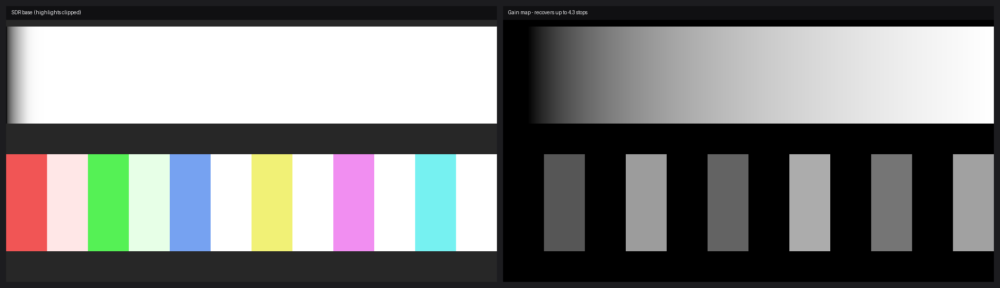

# HDR Shot

**True HDR screenshots on Windows.** When an HDR display is connected and HDR is
enabled, HDR Shot captures the desktop in the same wide, linear color space
Windows composites in (scRGB FP16) and saves it *with the highlights intact* — as
a gain-map **UltraHDR JPEG** (the cross-platform, macOS-style "HDR inside a
JPEG"), a lossless **OpenEXR**, a 10-bit **BT.2020 PQ HEIC**, or a 10-bit **PQ
AVIF**. On an SDR display it falls back to ordinary **PNG / JPEG / AVIF**. It has
a simple, modern capture UI in the spirit of the Windows Snipping Tool and the
macOS screenshot tools — **and** a machine-readable CLI built for scripts and AI
agents.

> Region select · whole-screen · multi-monitor · HDR/SDR auto-detect · agent-ready JSON

<p align="center">
  
  <br><em>What an UltraHDR file stores: the SDR base (highlights clipped to white) plus a gain map that recovers up to several stops of HDR highlight.</em>
</p>

---

## Why this exists

Windows' built-in Snipping Tool and `Print Screen` only ever give you an 8-bit
SDR image — even on an HDR monitor, the bright highlights are clipped to white.
macOS has captured real HDR screenshots (HEIC + gain map) for a while. HDR Shot
brings that to Windows: it grabs the actual floating-point HDR framebuffer and
preserves everything above SDR white. The whole capture stack is pure
`ctypes`/`comtypes` — **no Windows SDK or C compiler required.**

## Features

- **Real HDR capture** via DXGI Desktop Duplication in `R16G16B16A16_FLOAT`
  (scRGB, `1.0` = 80 nits). Highlights above paper white are preserved, not clipped.
- **Five HDR-aware outputs**
  - **UltraHDR JPEG** — SDR base + gain map (Google UltraHDR v1: MPF + `hdrgm`
    XMP + **ISO 21496-1** metadata). Opens *everywhere*; renders in HDR on Chrome,
    Android, Windows Photos **and Apple Photos / Preview / Quick Look**. Default
    for HDR content.
  - **OpenEXR** — lossless linear scRGB (half-float). Exact luminance for editing / analysis.
  - **HEIC** — 10-bit BT.2020 PQ (HDR10-style still). Optional `[heic]` extra.
  - **AVIF** — true 10-bit BT.2020 PQ HDR with the optional `[avif-hdr]` extra (8-bit SDR otherwise).
  - Plus **PNG / JPEG** for SDR.
- **Auto format** — UltraHDR for HDR content, PNG for SDR, macOS-style.
- **Smart multi-monitor** — enumerates every output, matches Qt screens to their
  physical FP16 buffers, handles mixed per-monitor DPI, and **stitches** regions
  that span two displays.
- **HDR-aware UI** — shows each display's live HDR on/off state; reminds you to
  toggle HDR (`Win`+`Alt`+`B`) when it's off but supported.
- **Agent-ready CLI** — `--json` everywhere, plus `parse` / `check` to read and
  verify HDR from a file. See [docs/AGENTS.md](docs/AGENTS.md).
- **Robust on idle screens** — forces a repaint so a one-shot grab always works,
  even on a static desktop.

## Install & run

Requires Windows 10 1803+ / Windows 11 and Python 3.10+.

### From source (GUI)
```bat
run.bat
```
`run.bat` creates a virtual environment, installs dependencies (with the GUI
extra) on first run, and launches the app. Manual equivalent:
```bat
python -m venv .venv
.venv\Scripts\python -m pip install -e .[gui]
.venv\Scripts\python -m hdrshot
```

### With pip
Not on PyPI yet — install from a checkout (or straight from GitHub):
```bash
pip install .                       # base: capture + PNG/JPEG/EXR/UltraHDR (headless CLI)
pip install ".[gui]"                # + the Qt GUI
pip install ".[avif-hdr]"           # + true 10-bit PQ HDR AVIF
pip install ".[heic]"               # + 10-bit PQ HEIC (pulls x265/GPL — see below)
pip install ".[all]"                # gui + heic + avif-hdr
# or without cloning:
pip install "hdrshot[gui] @ git+https://github.com/TheBigSasha/windows_hdr_screenshot"
```

## Usage

**GUI:** run `run.bat` (or `python -m hdrshot`). Click **Capture Region** (drag a
box, or double-click / `Enter` for the whole screen, `Esc` to cancel), pick a
format, and **Save**. Files go to your **Pictures\Screenshots** folder.

**Command line:**
```bat
python -m hdrshot info                     REM list displays + HDR status
python -m hdrshot full                     REM capture the primary display (auto format)
python -m hdrshot full --all --format exr  REM every display, as EXR
python -m hdrshot region 100 100 800 600   REM a virtual-desktop rectangle
python -m hdrshot selftest                 REM synthesise HDR, write every format, verify
python -m hdrshot --verbose ...            REM add logging to stderr
```

## For agents & scripts

Every capture/inspection command speaks JSON and returns meaningful exit codes, so
an agent can capture HDR and **read the real luminance** instead of guessing from
a tonemapped preview (where blown highlights look like flat white).

```bash
# One-shot: true-HDR file + viewable SDR preview + JSON
hdrshot capture --display 0 --format ultrahdr --out ./shots --preview ./shots/p.png

# Read HDR metadata back (exit 0 = HDR, 1 = SDR, 2 = undetermined; one file per call)
hdrshot parse ./shots/shot.jpg

# Assert an image really is HDR (sanity-check your own work)
hdrshot check ./shots/shot.jpg --min-stops 1.5
```

- **Full reference + JSON schemas:** [docs/AGENTS.md](docs/AGENTS.md)
- **Claude Code skills:** [`skills/hdr-screenshot`](skills/hdr-screenshot/SKILL.md)
  (capture + analyze) and [`skills/check-hdr-pixels`](skills/check-hdr-pixels/SKILL.md)
  (verify HDR). Copy a skill folder into `~/.claude/skills/` (or your project's
  `.claude/skills/`) to make it available to Claude Code.

> **Agent rule of thumb:** a tonemapped SDR preview **understates** HDR. Trust
> `peak_nits` / `peak_ratio` / `gainmap_max_stops` in the JSON, not the preview.

## Getting real HDR output

HDR content only exists when **Windows HDR is turned on** for the display
(`Settings → System → Display → Use HDR`, or `Win`+`Alt`+`B`). With HDR on, the
desktop composites in FP16 and HDR Shot captures highlights above SDR white. With
HDR off, the desktop is 8-bit SDR — screenshots are correct but contain no HDR, so
standard formats are used. The app (and `hdrshot info`) shows the current state.

`python -m hdrshot selftest` demonstrates and verifies the full HDR encode path
regardless of your display, by synthesizing a known HDR scene (a nit ramp to 1600
nits plus saturated HDR swatches) and writing/validating every format.

## How it works

```
core/         color science, pipeline, DisplayInfo/MonitorCapture types (pure, cross-platform)
encoders/     ultrahdr (gain map + ISO 21496-1) · exr · heic (PQ) · avif_hdr (PQ) · sdr
backends/     CaptureBackend protocol + win32/ (lazy ctypes: DXGI Desktop Duplication)
ui/           Qt shell — toolbar + tray · region overlay · preview card
agentcli.py   --json serialisation, `parse`, `check`, one-shot `capture`
__main__.py   CLI (works on any OS for help/selftest/parse; backend-gated for capture)
```

The pure layers (`core`, `encoders`, `agentcli`) import on **any OS**; only the
Win32 backend touches ctypes, and it's loaded lazily behind a platform check. COM
methods are invoked directly by vtable index (documented in `backends/win32/com.py`).

## Notes & limitations

- **HEIC** needs the `[heic]` extra (x265/GPL encoder); it is **not** bundled in
  binary releases. UltraHDR, EXR and AVIF cover HDR without it. See
  [THIRD_PARTY_NOTICES.md](THIRD_PARTY_NOTICES.md).
- **HDR AVIF** needs the `[avif-hdr]` extra (imagecodecs/libavif); without it AVIF
  output is 8-bit SDR.
- **Rotated (portrait) displays** are rotated into desktop orientation best-effort;
  verify framing in the preview.

## Development

```bash
pip install -e .[dev]
python -m pytest        # unit tests (color math, byte-exact UltraHDR MPF, pipeline, agent CLI)
python -m ruff check .  # lint
python -m pyright       # type check (pure layers)
```
CI runs the suite on Windows (full) and Ubuntu (cross-platform pure tests). See
[CONTRIBUTING.md](CONTRIBUTING.md) and the [roadmap](https://github.com/TheBigSasha/windows_hdr_screenshot/issues/18).

## License

MIT — see [LICENSE](LICENSE). Third-party components and their licenses (including
the LGPL Qt / GPL x265 considerations for bundling) are in
[THIRD_PARTY_NOTICES.md](THIRD_PARTY_NOTICES.md).
